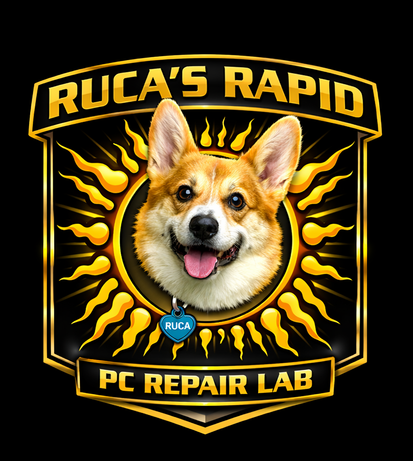
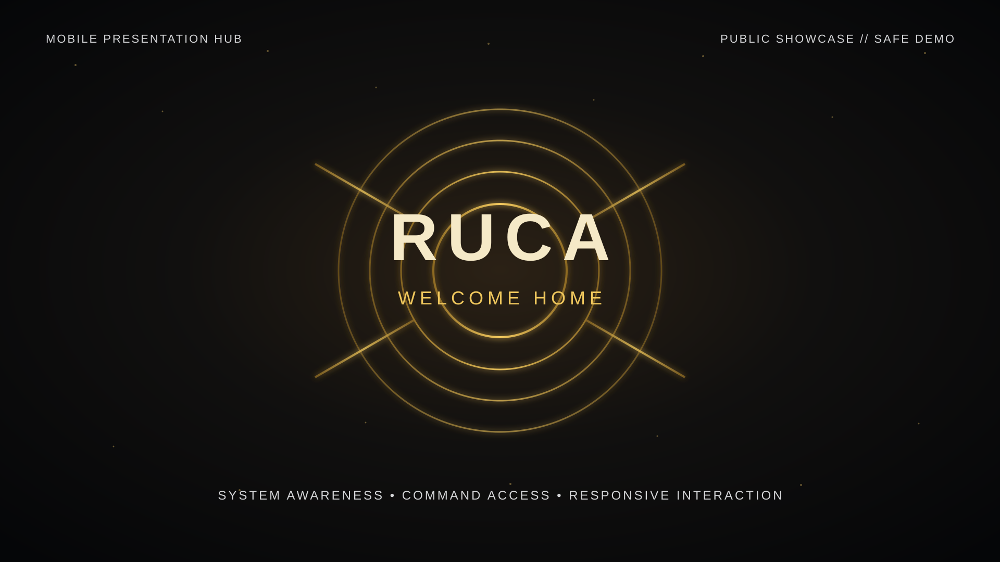

<p align="center">
  
</p>

<h1 align="center">Anthony Moncion - Interaction Design Portfolio</h1>

<p align="center">
  A recruiter-facing portfolio centered on RUCA Command Core, a controller-first personal computing system built around clarity, trustworthy system feedback, and responsive interaction.
</p>

<p align="center">
  <a href="https://ruca-mobile-presentation-hub.vercel.app/"><strong>Portfolio</strong></a>
  &middot;
  <a href="https://ruca-mobile-presentation-hub.vercel.app/index.html#home"><strong>Interactive Prototype</strong></a>
  &middot;
  <a href="https://ruca-mobile-presentation-hub.vercel.app/resume/Anthony_Moncion_Google_Maps_Interaction_Designer_Resume.pdf"><strong>Application Resume</strong></a>
</p>



## Overview

RUCA Command Core explores what a personal computing experience can feel like when telemetry, navigation, media, diagnostics, and control are designed as one connected system instead of a pile of unrelated utilities.

This repository contains the public mobile presentation build. It is intentionally separated from the private desktop runtime and uses safe local demonstration data rather than workstation access, credentials, or native system commands.

## Experience

- **HOME** presents RUCA's system heart and machine-state overview.
- **PLAY** organizes entertainment and application commands into focused districts.
- **WORLD** demonstrates weather, markets, news, sports, and technology views.
- **HEALTH** presents diagnostic guidance and advisory states.
- **CONTROL** previews visual atmosphere, theme, and interface settings.
- **COMMAND SEARCH** provides direct navigation through routes and demo commands.
- **PORTFOLIO + RESUME** document the design process and product thinking inside the same experience.

## Product qualities

- Responsive layouts for phone, tablet, and landscape use
- Installable Progressive Web App behavior
- Offline navigation through the service worker cache
- Keyboard, touch, and command-search interaction
- Reduced-motion support
- Local deterministic fixtures for a safe public demonstration
- No desktop bridge, native execution, personal files, or credentials

## Project structure

```text
assets/                  Core interface styles, scripts, and brand assets
data/                    Local demonstration fixtures
icons/                   PWA icons
portfolio/               Case study, project story, and visual evidence
resume/                  Resume PDF
index.html               Main presentation experience
manifest.webmanifest     PWA metadata
service-worker.js        Offline cache and navigation support
docs/                    Concise technical and validation notes
```

## Run locally

```powershell
py -m http.server 8788 --bind 127.0.0.1
```

Open `http://localhost:8788/` in a browser.

## Design and development

Created by **AceBoom11207** as a product design, UX strategy, and systems-design project. RUCA combines interaction design, interface architecture, visual direction, prototyping, validation, and AI-assisted development into one evolving product system.

## Status

This repository is the public presentation build, not the complete private RUCA desktop runtime. The experience is actively evolving.
