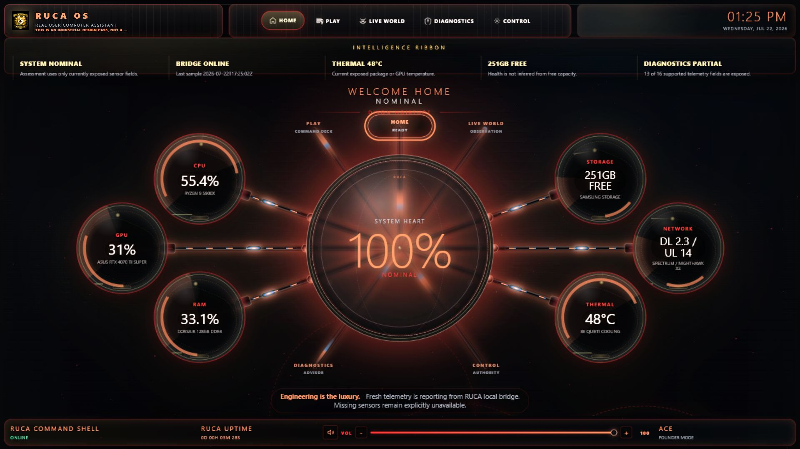
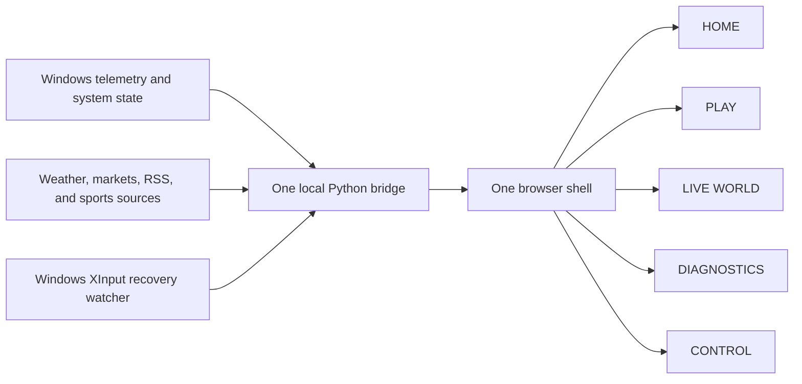
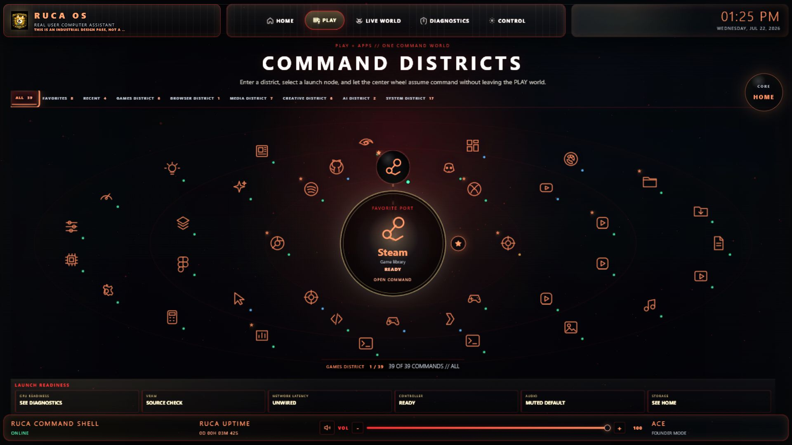
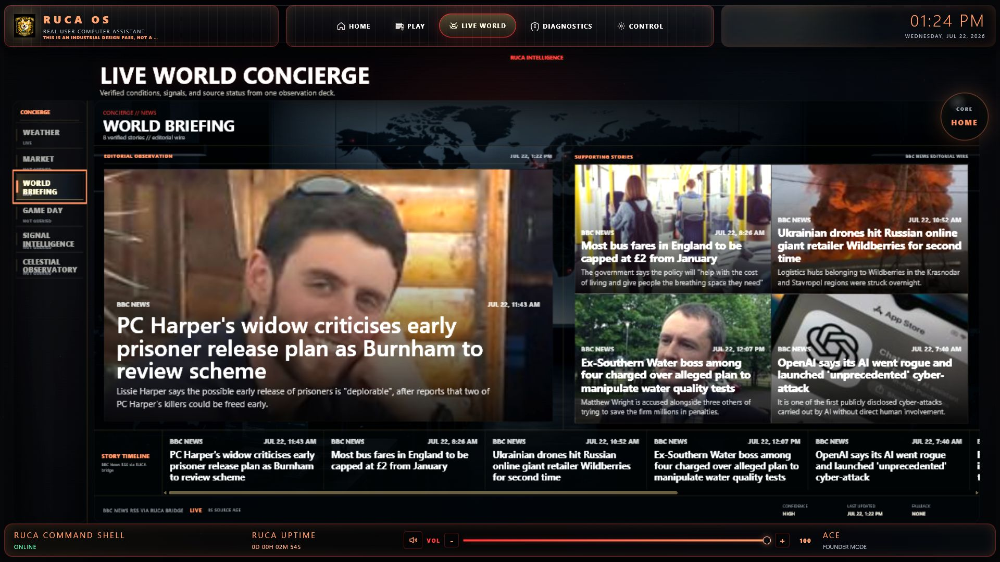
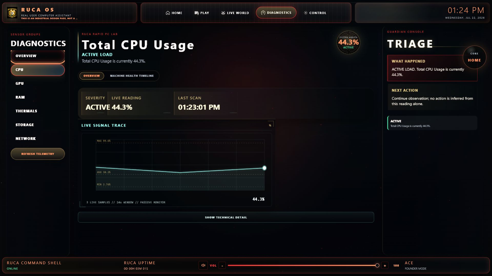
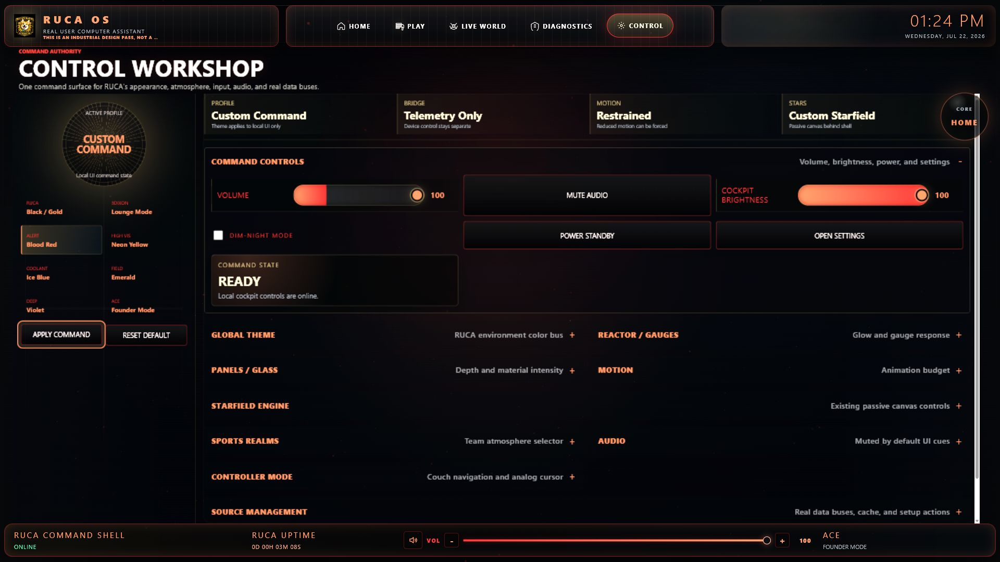

# RUCA Command Core

## Welcome Home

**The Console Experience. The Power of PC.**

RUCA is a controller-first personal computing system. It is designed for people who value PC performance and customization but miss the calm, coherent ritual of turning on a console and immediately knowing where they are, whether the system is ready, and what to do next.

## Project Snapshot

- **Role:** Founder and Lead Interaction Designer
- **Status:** Independent product project, 2026-present
- **Platform:** Windows, browser shell, local Python bridge
- **Primary audience:** Console-to-PC gamers, builders, creators, and enthusiasts
- **Design objective:** Power without intimidation
- **Core constraint:** Truth before beauty; missing data must remain missing

## The Problem

PC gaming delivers performance and flexibility, but its experience is fragmented across launchers, hardware monitors, settings utilities, media apps, feeds, and Windows surfaces. The user carries the integration burden.

Early RUCA prototypes reproduced that fragmentation. New scripts were stacked over old renderers. Telemetry contracts duplicated. Visual systems competed. Features existed, but the product did not feel like one machine.

The design problem became:

> How might a Windows PC welcome the user home, communicate readiness, reveal complexity only when needed, and remain fully honest about what is live?

## Product Principles

1. Experience before technology.
2. Truth before beauty.
3. Build places, not pages.
4. Reduce cognitive load.
5. Reveal complexity progressively.
6. Replace, never stack.
7. Every interaction has a trigger, action, and feedback response.
8. Every world has a back path.

## Information Architecture

RUCA uses five primary worlds:

| World | User question | Role |
| --- | --- | --- |
| HOME | Am I ready? | Machine heart and readiness overview |
| PLAY | What do I want to launch? | Games, apps, media, creative, AI, and system commands |
| LIVE WORLD | What is happening around me? | Weather, markets, news, sports, and technology |
| DIAGNOSTICS | Am I safe, and what should I do? | Protective system explanation and drill-down |
| CONTROL | How should RUCA behave? | Appearance, atmosphere, input, audio, and sources |

## System Architecture

The architecture is intentionally conservative: one route owner, one telemetry endpoint, one normalized application registry, one starfield loop, one browser controller manager, and one local bridge listener.

## Design Process

### 1. Audit Before Editing

I mapped active files, renderers, telemetry bindings, source routes, controller loops, duplicate registries, and CSS ownership. This separated working behavior from visual debt and prevented another rebuild.

### 2. Consolidate Ownership

PLAY and APPS were merged into one command world. Two competing application data structures were replaced by one 39-command registry with local SVG icons, favorites, recents, and a shared drawer.

### 3. Establish Product Worlds

Each page received a clear mission and visual center of gravity. HOME belongs to the System Heart. PLAY belongs to the selected command. Live World belongs to the active observation. Diagnostics belongs to Guardian status. Control belongs to command authority.

### 4. Validate Truth And Interaction

Every pass included backups, exact diffs, syntax checks, browser console inspection, route tests, viewport measurements, and rollback instructions. Source failures were tested as product states rather than hidden.

## HOME // Machine Heart

HOME answers one question: **Am I ready?**

One System Heart anchors six live machine gauges: CPU, GPU, RAM, storage, network, and thermal. The gauges share measured radial geometry. Six conduits visibly move real machine energy toward or away from the Heart. Five route beacons extend navigation from the same core.

The design combines Swiss calibration, aerospace instrumentation, and restrained material depth without turning telemetry into decorative fiction.

## PLAY // Command Districts

PLAY uses one 39-command registry and one orbit renderer. Commands are organized into six durable districts:

- Games: 6
- Browser: 1
- Media: 7
- Creative: 6
- AI: 2
- System: 17

Desktop and tablet use measured radial geometry. Phone layouts use the same registry and nodes in a compact command dock. Selection updates one central command state and opens one truthful action drawer.

## LIVE WORLD // Concierge

Live World turns five real source buses into one observation experience:

- Weather: Open-Meteo current conditions and forecast
- Markets: configured market providers with partial/stale truth states
- News: normalized BBC RSS
- Sports: normalized ESPN scoreboard data
- Tech: normalized BBC Technology RSS

The active lane owns the visual hierarchy. Source status is visible. Wrong-lane content is rejected. Missing data exposes retry, configuration, cache, location, or API-key actions instead of a dead-end label.

## DIAGNOSTICS // Guardian

Diagnostics translates machine state into plain-English protection. It combines health score, current/min/max/threshold readings, live traces, sensor drill-down, benchmark entry points, and Guardian guidance.

The intended questions are human, not technical:

- Am I safe?
- What is wrong?
- Why does it matter?
- What should I check first?
- What should I not panic about?
- What should I do next?

## CONTROL // Workshop

Control was not missing behavior; CSS had hidden it. The M01 Workshop restores the existing command authority without adding another settings renderer.

The persistent surface contains the active profile, seven theme presets, Apply, Reset, and six quick controls. Eleven advanced systems remain available through progressive drill-down: theme, reactor, panels, motion, starfield, sports atmosphere, audio, controller, sources, location, and command controls.

## Controller And Recovery

RUCA supports mouse, keyboard, WASD, D-pad navigation, controller focus, an in-app analog cursor, reduced motion, and a Windows recovery foundation. START+BACK can summon the recovery path through one XInput watcher when the browser architecture allows it.

The recovery system and browser controller manager are separate by responsibility, not duplicated.

## Outcome

M01 currently validates:

- Five coherent product worlds
- One 39-command registry and renderer
- Six HOME telemetry gauges and six moving conduits
- Five separated Live World source lanes
- Eleven reachable Control systems
- One starfield canvas and animation loop
- One local Python bridge listener
- Zero browser console warnings or errors in the final M01 route pass
- No document-level horizontal overflow in validated desktop, tablet, and phone layouts

These are system and validation results, not claims of market adoption or user impact.

## What I Learned

The hardest product work was not adding features. It was deciding what owned each state, removing duplicate paths, and making the visible hierarchy match the architecture.

RUCA became more usable when I stopped treating missing data as a visual defect. Honest unavailable states, plain-English guidance, and clear recovery actions made the product feel more trustworthy than decorative completeness.

The project also reinforced that controller UX is not keyboard UX with different buttons. Couch distance, focus visibility, hit targets, back paths, and recovery from Windows all have to be designed as one operating context.

## Next Validation

- Moderated usability sessions with console-to-PC gamers
- Task completion and recovery-path testing with a physical controller
- General verified application launch service
- Continued Diagnostics spatial refinement
- Public product critique and iteration

## Closing

RUCA is not a dashboard. It is an attempt to build the PC experience that should have already existed.

**Welcome Home.**
